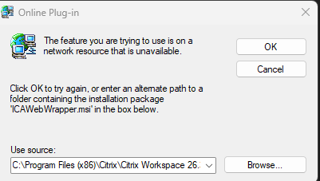

# Citrix Problem Solver & Repair Bot

A comprehensive PowerShell repair bot and diagnostic suite for Citrix Receiver and Citrix Workspace. It forcefully terminates hanging processes, clears deep display and network deadlocks, repairs High-DPI and multi-monitor resolution issues, and permanently resolves the recurring **"ICAWebWrapper.msi / network resource unavailable"** Windows Installer loop.

---

## What This Bot Solves

When Citrix processes crash, get forcefully killed, or fail during automatic background updates, Windows is left in an unstable state. This bot actively diagnoses and repairs each broken subsystem:

### 1. "The feature you are trying to use is on a network resource that is unavailable (ICAWebWrapper.msi)" `[NEW FEATURE]`

#### Sample Error Dialog:
<p align="center">
  
</p>

```text
+------------------------------------------------------------------------+
| Online Plug-in                                                    [X]  |
+------------------------------------------------------------------------+
|  The feature you are trying to use is on a network resource that is   |
|  unavailable.                                                          |
|                                                                        |
|  Click OK to try again, or enter an alternate path to a folder         |
|  containing the installation package 'ICAWebWrapper.msi' in the        |
|  box below.                                                            |
|                                                                        |
|  Use source:                                                           |
|  [ C:\Program Files (x86)\Citrix\Citrix Workspace 26.x.x.x\   v ]      |
|                                               [  OK  ]  [ Cancel ]     |
|                                               [ Browse... ]            |
+------------------------------------------------------------------------+
```

* **The Root Cause:** When Citrix Workspace updates or uninstalls incompletely, Windows Installer retains hundreds of orphaned component locks (`UserData\...\Components`) and an auto-start `InstallHelper.exe` entry in the Windows `Run` key. Every time Windows boots or Citrix is invoked, Windows Installer triggers a silent self-repair looking for the original `ICAWebWrapper.msi` source package. Because the original folder no longer contains that exact package version, Windows locks up with an unavailable network resource dialog.
* **The Fix:** Option `[2]` (or `.\fix_citrix_msi.ps1`) presents a clear **safety warning**, prompts for explicit user confirmation, automatically exports a **safety registry backup (.reg)** to your Desktop, terminates deadlocked installer processes, purges the orphaned component locks, removes the `InstallHelper` auto-start trigger, and clears broken installer caches.

### 2. Remote Desktop (RDP / mstsc.exe) Hanging
* **The Root Cause:** Killing `wfica32.exe` mid-session leaves Windows display and terminal networking hooks locked. Opening Windows Remote Desktop (`mstsc.exe`) afterward locks up indefinitely.
* **The Fix:** Sweeps for hidden deadlocked RDP client instances and restarts `TermService` (Remote Desktop Services) to release hooks without requiring a computer reboot.

### 3. "Another installation is already in progress" (.ica launch blocked / Error 1618)
* **The Root Cause:** Windows Installer (`msiexec.exe`) gets stuck in the background after an unnatural termination, blocking new `.ica` files or installer executions.
* **The Fix:** Forcefully clears stuck `msiexec.exe` background tasks and releases MSI mutex locks.

### 4. Blurry Text, Low Resolution, or Widescreen Caps
* **The Root Cause:** Compatibility flags or legacy `MaxMonitorDimension` registry limits clamp Citrix to lower resolutions or break High-DPI scaling across 4K and ultrawide monitors.
* **The Fix:** Configures native DPI awareness (`DpiAware=1`) in HKCU and HKLM Policies, removes `MaxMonitorDimension`, and clears corrupted Explorer window caches.

---

## Interactive Bot Menu

Simply execute `kill_citrix.ps1`. If running as a standard user, it will display the menu and automatically request Administrator elevation when executing repair operations:

```powershell
.\kill_citrix.ps1
```

```text
==========================================================================
                 CITRIX PROBLEM SOLVER & REPAIR BOT                      
                     [Administrator]                                     
==========================================================================
 Select an option to troubleshoot or repair your Citrix environment:

  [1] Kill Citrix & Reset Deadlocks (RDP hooks & msiexec)
  [2] Fix Stuck MSI / 'ICAWebWrapper.msi' Error [NEW FEATURE]
  [3] Fix High-DPI Resolution & Monitor Scaling Limits
  [4] Clean Windows Compatibility (AppCompat) Overrides
  [5] Verify Citrix Configuration & Fix Status
  [6] Hard Reset Citrix Workspace (Clear Local AppData & HKCU)
  [7] Full Automated System Repair (Kill + MSI Fix + RDP + DPI)
  [0] Exit
==========================================================================
```

---

## Command-Line & Automation Options

You can also run specific repair actions directly via command-line switches without the interactive menu:

| Switch / Parameter | Description |
| :--- | :--- |
| `.\kill_citrix.ps1 -Kill` | Kills all Citrix processes and resets RDP / `msiexec` deadlocks. |
| `.\kill_citrix.ps1 -FixMSI` | Runs the new MSI registry repair for `ICAWebWrapper.msi` (includes warning & confirmation). |
| `.\kill_citrix.ps1 -FixResolution` | Enables High-DPI awareness and clears monitor resolution limits. |
| `.\kill_citrix.ps1 -CleanFlags` | Purges Citrix DPI override flags from Windows AppCompat. |
| `.\kill_citrix.ps1 -Verify` | Performs a read-only health check on Citrix settings and installer locks. |
| `.\kill_citrix.ps1 -HardReset` | Destructive wipe of local Citrix cache and HKCU settings (prompts for confirmation). |
| `.\kill_citrix.ps1 -FullFix` | Runs an end-to-end automated sequence (Kill + MSI Fix + RDP reset + DPI fix + Verify). |
| `.\kill_citrix.ps1 -Force` | Suppresses confirmation prompts (useful for automated IT deployments). |

---

## Standalone Scripts

Individual repair scripts can also be run independently:

* [`fix_citrix_msi.ps1`](file:///c:/Users/Kiosk/github/fix_citrix/fix_citrix_msi.ps1) - Dedicated MSI and `ICAWebWrapper.msi` registry repair with safety warning and Desktop `.reg` backup.
* [`fix_citrix_resolution.ps1`](file:///c:/Users/Kiosk/github/fix_citrix/fix_citrix_resolution.ps1) - High-DPI scaling configuration.
* [`remove_resolution_limits.ps1`](file:///c:/Users/Kiosk/github/fix_citrix/remove_resolution_limits.ps1) - Removes `MaxMonitorDimension` cap.
* [`clean_compatibility_flags.ps1`](file:///c:/Users/Kiosk/github/fix_citrix/clean_compatibility_flags.ps1) - Cleans Windows AppCompat layers.
* [`verify_fix_status.ps1`](file:///c:/Users/Kiosk/github/fix_citrix/verify_fix_status.ps1) - Verifies current system configuration.
* [`hard_reset_citrix.ps1`](file:///c:/Users/Kiosk/github/fix_citrix/hard_reset_citrix.ps1) - Full preference and cache reset.
